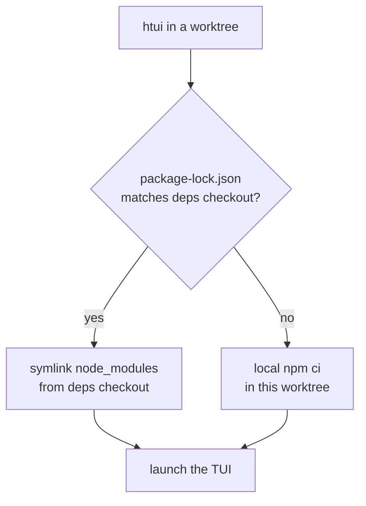

# TUI from Worktrees

The Python core runs fine from any [git worktree](../user-guide/git-worktrees.md) — `cd` in and `allr` just works. The TypeScript surface does not: `ui-tui/` needs a populated `node_modules`, and a fresh `npm ci` per worktree is slow and duplicates gigabytes across every branch you have checked out.

`htui` is a shell helper that closes that gap. It launches the TUI **from the current worktree** while borrowing `node_modules` from one canonical checkout — so a throwaway branch costs a symlink, not an install.

It's a developer convenience, not a shipped command. Drop it in `~/.zshrc`; adapt paths to taste.

## The deps-sharing model

One checkout is the **deps checkout** — the one place you actually run `npm install`. Every other worktree links against it, and only re-installs locally when its lockfile diverges (a branch that bumps a dependency must not silently run against stale packages).



One env var names the canonical checkout:

| Variable | Meaning |
|----------|---------|
| `ALLR_MAIN_CHECKOUT` | The deps checkout — where `node_modules` really lives, and whose `.venv/bin/python` runs the backend. |

It isn't read by Allr itself — it's private to these helpers. The variables Allr *does* read are covered in [Environment Variables](../reference/environment-variables.md).

## `htui` — TUI from the worktree

The Ink TUI has a dev path already: `allr --tui --dev` runs the TypeScript sources via `tsx` instead of the prebuilt bundle. `htui` is a one-liner over it that also points the run at the current worktree's `ui-tui/`:

```bash
htui() {
  local root
  root="$(_allr_root)" || { echo "htui: not in an Allr checkout" >&2; return 1; }
  ( cd "$root" && PYTHONPATH="$root" \
      "$ALLR_MAIN_CHECKOUT/.venv/bin/python" -m hermes_cli.main --tui --dev "$@" )
}
```

`--dev` compiles from source, so it links `ui-tui/node_modules` from `ALLR_MAIN_CHECKOUT` when the root lockfile matches and installs locally otherwise (see [`_allr_root` / linking helpers](#shared-helpers)).

:::warning `--dev` and `ALLR_TUI_DIR` are mutually exclusive
`ALLR_TUI_DIR` points Allr at a *prebuilt* bundle (Nix, system packages), which has no source to hot-reload. If it's set in your shell, `allr --tui --dev` exits with an error. Run `unset ALLR_TUI_DIR` before `htui`.
:::

:::info The Allr app has its own dev loop
The cross-platform app lives at `apps/hermes-universal/` and is built with Tauri, not Electron. It does not share this helper — see [`apps/hermes-universal/README.md`](https://github.com/allr-ajmx/allr-agent/blob/main/apps/hermes-universal/README.md) for its dev server, platform targets, and packaging.
:::

## Shared helpers

`htui` resolves the enclosing checkout and links deps like this:

```bash
# The enclosing worktree, verified as a real Allr checkout.
_allr_root() {
  local root
  root="$(git rev-parse --show-toplevel 2>/dev/null)" || return 1
  [[ -f "$root/hermes_cli/main.py" && -d "$root/ui-tui" ]] && print -r "$root"
}

# Symlink node_modules from the deps checkout — never over an existing tree.
_allr_link_deps() {
  local target="${1%/}" source="${2%/}"
  [[ -d "$source/node_modules" ]] || return 1
  [[ -e "$target/node_modules" ]] || ln -s "$source/node_modules" "$target/node_modules"
}
```

:::info Why link only when locks match
A symlink to a divergent `node_modules` is worse than no install — the worktree would build against packages its own lockfile never declared. Byte-comparing `package-lock.json` is the cheap, exact guard: same lock ⇒ safe to borrow; different lock ⇒ `npm ci` locally.
:::

## See also

- [Git Worktrees](../user-guide/git-worktrees.md) — the isolation model this helper builds on
- [TUI](../user-guide/tui.md) — `allr --tui --dev` and the `ALLR_TUI_DIR` prebuild path
- [Allr App](../user-guide/desktop.md) — the cross-platform app and how it reaches a gateway
- [Environment Variables](../reference/environment-variables.md) — every `ALLR_*` variable Allr reads
